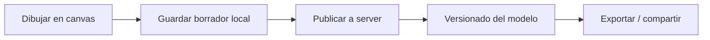

# 02 — Arquitectura

> Documento: `docs/02-arquitectura.md`

## Diseño de alto nivel

El proyecto es un **monorepo simple** con dos aplicaciones independientes que se comunican por HTTP:

```
┌─────────────────────────┐        ┌──────────────────────────┐
│        CLIENT           │  HTTP  │         SERVER           │
│  Vite + React + TS      │ ─────► │  Express 5 + TS (Node)   │
│                         │  /api/*│                          │
│  Modelador visual       │ ◄───── │  Rutas REST              │
│  (React Flow, planeado) │        │  (health hoy; CRUD luego)│
└─────────────────────────┘        └──────────────────────────┘
        :5173                             :4000
```

- El client usa el **proxy de Vite**: en desarrollo, cualquier llamada a `/api/*` en el navegador se redirige automáticamente a `localhost:4000`. No hay CORS en la práctica para el client (aunque CORS está habilitado en el server por si se consume desde otro origen).
- Cada aplicación tiene su propio `package.json` (no usa workspaces de npm): se gestionan con `npm --prefix <carpeta> ...`.

## Flujo de una petición (ejemplo real)

1. El usuario dibuja un proceso en el editor del client.
2. El client envía el modelo a `POST /api/processes` (endpoint planeado, Fase 3).
3. Vite proxy reenvía a `http://localhost:4000/api/processes`.
4. Express procesa, valida y persiste.
5. El client recibe el recurso creado y actualiza la UI.

## Componentes planeados (vista de features)

```
react-bpmn
├── Editor (client)
│   ├── Paleta        → elementos disponibles (paso, decisión, inicio/fin, espera…)
│   ├── Lienzo        → canvas donde se dibujan nodos y conexiones (React Flow)
│   ├── Panel de propiedades → edita el nodo/conexión seleccionado
│   └── Barra de herramientas → guardar, exportar/importar, zoom, deshacer
├── API (server)
│   ├── /processes    → CRUD de procesos modelados
│   └── /health       → estado del servicio
└── Almacenamiento
    ├── Hito 1: local (localStorage/IndexedDB en el navegador)
    └── Hito 2: persistencia en server (SQLite/Postgres — a definir)
```

## Decisiones que sostienen esta arquitectura

- **Monorepo simple** → ver [AD-001](./09-decisiones-de-diseno.md).
- **Client y server separados** → el client puede evolucionar (y hasta reemplazarse) sin tocar la API; la API puede servir a otros clientes.
- **Proxy de Vite en dev** → sin configuración CORS en el día a día.

## Puertos

| Servicio | Puerto | Uso |
| --- | --- | --- |
| Client (Vite dev) | 5173 | Interfaz web |
| Server (Express) | 4000 | API REST (configurable con `PORT`) |

## Diagrama de estado del modelo (planeado)



> `mermaid` es solo representación en estos docs; el renderizado depende del visor de cada uno.